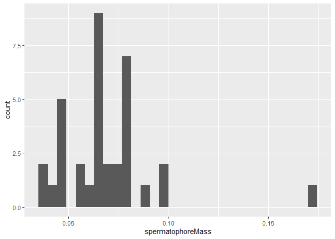
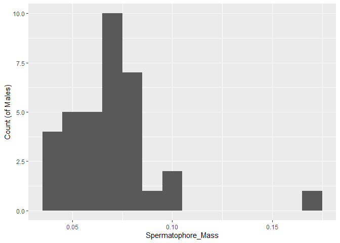
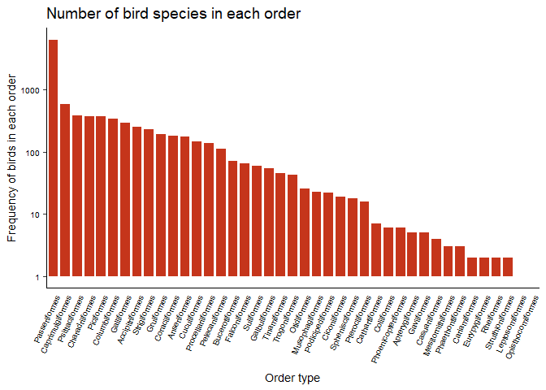

Lab 3 Report
================
Connor Hayes
2021-02-02

Instructions for this lab report can be found on [Your assignment
section of Lab Assignment 3 Introduction to
ggplot2](https://biol275-msum.github.io/introduction-to-ggplot2.html#your-assignment)
on the lab website.

## Fireflies

> A. Insert an R code chunk and create a graph depicting the frequency
> distribution of the 35 mass measurements. It should have legible text
> and appropriate axis labels.

``` r
# load packages -----------------------------------------------------------

library(tidyverse)
```

    ## -- Attaching packages --------------------------------------- tidyverse 1.3.0 --

    ## v ggplot2 3.3.3     v purrr   0.3.4
    ## v tibble  3.0.4     v dplyr   1.0.2
    ## v tidyr   1.1.2     v stringr 1.4.0
    ## v readr   1.4.0     v forcats 0.5.0

    ## -- Conflicts ------------------------------------------ tidyverse_conflicts() --
    ## x dplyr::filter() masks stats::filter()
    ## x dplyr::lag()    masks stats::lag()

``` r
# Mass of firefly ---------------------------------------------------------
firefly_data <- read_csv ("https://whitlockschluter.zoology.ubc.ca/wp-content/data/chapter02/chap02q19FireflySpermatophoreMass.csv")
```

    ## 
    ## -- Column specification --------------------------------------------------------
    ## cols(
    ##   spermatophoreMass = col_double()
    ## )

``` r
count (firefly_data, spermatophoreMass)
```

    ## # A tibble: 26 x 2
    ##    spermatophoreMass     n
    ##                <dbl> <int>
    ##  1             0.037     1
    ##  2             0.039     1
    ##  3             0.041     1
    ##  4             0.045     1
    ##  5             0.046     1
    ##  6             0.047     1
    ##  7             0.048     2
    ##  8             0.055     1
    ##  9             0.056     1
    ## 10             0.059     1
    ## # ... with 16 more rows

``` r
ggplot(data = firefly_data)
```

<!-- -->

``` r
ggplot(data = firefly_data) +
  geom_histogram(mapping = aes(x = spermatophoreMass))
```

    ## `stat_bin()` using `bins = 30`. Pick better value with `binwidth`.

<!-- -->

``` r
# Cleaning up the graph ---------------------------------------------------
ggplot(data = firefly_data) +
  geom_histogram(mapping = aes(x =spermatophoreMass), binwidth = 0.010)+
labs(x="Spermatophore_Mass", y="Count (of Males)")
```

<!-- -->

> B. What type of graph did you choose in part (A)? Why?

-   Histogram. I chose this graph due to the fact we only used numerical
    variables to help define our graph.

> C. Describe the shape of the frequency distribution. What are its main
> features?

-   Right skewed what we see is that the averages are a lot higher on
    the left side compared to the right side. What we also see is that
    the mean, median, and mode will all be different numbers (the mean
    and mode are two different numbers compared to a bell curve where
    the mean and mode are the same number.)

> D. What term would be used to describe the largest measurement in the
> frequency distribution? You can refer to the lecture slides, your
> notes, or the textbook.

-   An outlier

## Bird orders

I read the data using the code provided by the instructor. The dataset
is from the auk package and was originally named ebird\_taxonomy. I
converted it to a tibble, removed non-species taxa, and named the new
dataset birds.

``` r
library(auk)                          # load the auk package
```

    ## auk 0.4.2 is designed for EBD files downloaded after 2019-08-15. 
    ## No EBD data directory set, see ?auk_set_ebd_path to set EBD_PATH 
    ## eBird taxonomy version:  2019

``` r
birds <- ebird_taxonomy %>%           # start with the ebird_taxonomy data
  as_tibble() %>%                     # tibbles print better in the console
  filter(category == "species")       # remove non-species taxa
```

``` r
birds
```

    ## # A tibble: 10,721 x 9
    ##    species_code scientific_name common_name order family family_common category
    ##    <chr>        <chr>           <chr>       <chr> <chr>  <chr>         <chr>   
    ##  1 ostric2      Struthio camel~ Common Ost~ Stru~ Strut~ Ostriches     species 
    ##  2 ostric3      Struthio molyb~ Somali Ost~ Stru~ Strut~ Ostriches     species 
    ##  3 grerhe1      Rhea americana  Greater Rh~ Rhei~ Rheid~ Rheas         species 
    ##  4 lesrhe2      Rhea pennata    Lesser Rhea Rhei~ Rheid~ Rheas         species 
    ##  5 tabtin1      Nothocercus ju~ Tawny-brea~ Tina~ Tinam~ Tinamous      species 
    ##  6 higtin1      Nothocercus bo~ Highland T~ Tina~ Tinam~ Tinamous      species 
    ##  7 hootin1      Nothocercus ni~ Hooded Tin~ Tina~ Tinam~ Tinamous      species 
    ##  8 grytin1      Tinamus tao     Gray Tinam~ Tina~ Tinam~ Tinamous      species 
    ##  9 soltin1      Tinamus solita~ Solitary T~ Tina~ Tinam~ Tinamous      species 
    ## 10 blatin1      Tinamus osgoodi Black Tina~ Tina~ Tinam~ Tinamous      species 
    ## # ... with 10,711 more rows, and 2 more variables: taxon_order <dbl>,
    ## #   report_as <chr>

``` r
distinct(birds, scientific_name)
```

    ## # A tibble: 10,721 x 1
    ##    scientific_name          
    ##    <chr>                    
    ##  1 Struthio camelus         
    ##  2 Struthio molybdophanes   
    ##  3 Rhea americana           
    ##  4 Rhea pennata             
    ##  5 Nothocercus julius       
    ##  6 Nothocercus bonapartei   
    ##  7 Nothocercus nigrocapillus
    ##  8 Tinamus tao              
    ##  9 Tinamus solitarius       
    ## 10 Tinamus osgoodi          
    ## # ... with 10,711 more rows

``` r
count(birds, order)
```

    ## # A tibble: 41 x 2
    ##    order                n
    ##    <chr>            <int>
    ##  1 Accipitriformes    252
    ##  2 Anseriformes       178
    ##  3 Apterygiformes       5
    ##  4 Bucerotiformes      72
    ##  5 Caprimulgiformes   597
    ##  6 Cariamiformes        2
    ##  7 Casuariiformes       4
    ##  8 Cathartiformes       7
    ##  9 Charadriiformes    379
    ## 10 Ciconiiformes       19
    ## # ... with 31 more rows

> E. How many bird species are in the new birds dataset? How did you
> find out?

-   There are 10,721 bird species in the new birds dataset, this can be
    figured out by pulling up the data table and reading the
    species\_code portionor by creating a contingency table

> H. How many orders are there? You can get this right by counting on
> the graph, but you will only get full points if you use some code to
> figure it out.

-   There are 41 bird orders, this can be seen by reading the table and
    using the code read.table(order) or by using a contingency table.
    read.table(order)

> F. Insert an R code chunk and create a graph depicting the
> distribution of orders in the birds dataset. Sort the orders with the
> most frequent on the left. It should have legible text and appropriate
> axis labels.

``` r
library (tidyverse)

library(auk)                          # load the auk package
birds <- ebird_taxonomy %>%           # start with the ebird_taxonomy data
  as_tibble() %>%                     # tibbles print better in the console
  filter(category == "species")       # remove non-species taxa

ggplot(data = birds) +
  geom_bar(mapping = aes(x = fct_infreq(order)), fill = "#C5351B", 
           width = .8) +
  labs(x = "Order type", y = "Frequency of birds in each order", 
       title = "Number of bird species in each order" )+
  scale_y_log10() +
  theme_classic(base_size = 12) +
  theme(
    axis.title = element_text(size = rel(0.9)),
    axis.text = element_text(color = "black", size = rel(.6)),
    axis.text.x = element_text(angle = 65, hjust = 1),
    axis.ticks.x = element_blank() )
```

<!-- -->

> G. What kind of graph did you create? Why?

-   We created a bar graph, this is because our data set we are looking
    at consists of a categorical variable

## Links to peer review

I reviewed Carter Martinson’s lab report at this URL:
<https://github.com/BIOL275-MSUM/lab-3-intro-to-ggplot-cartermartinson1>

Carter Martinson reviewed my lab report at this URL:
<https://github.com/BIOL275-MSUM/lab-3-intro-to-ggplot-chayes307/issues>

## Session Info

Here is my session information:

``` r
sessioninfo::session_info()
```

    ## - Session info ---------------------------------------------------------------
    ##  setting  value                       
    ##  version  R version 4.0.3 (2020-10-10)
    ##  os       Windows 10 x64              
    ##  system   x86_64, mingw32             
    ##  ui       RTerm                       
    ##  language (EN)                        
    ##  collate  English_United States.1252  
    ##  ctype    English_United States.1252  
    ##  tz       America/Chicago             
    ##  date     2021-02-02                  
    ## 
    ## - Packages -------------------------------------------------------------------
    ##  package     * version date       lib source        
    ##  assertthat    0.2.1   2019-03-21 [1] CRAN (R 4.0.3)
    ##  auk         * 0.4.3   2020-11-23 [1] CRAN (R 4.0.3)
    ##  backports     1.2.0   2020-11-02 [1] CRAN (R 4.0.3)
    ##  broom         0.7.3   2020-12-16 [1] CRAN (R 4.0.3)
    ##  cellranger    1.1.0   2016-07-27 [1] CRAN (R 4.0.3)
    ##  cli           2.2.0   2020-11-20 [1] CRAN (R 4.0.3)
    ##  colorspace    2.0-0   2020-11-11 [1] CRAN (R 4.0.3)
    ##  crayon        1.3.4   2017-09-16 [1] CRAN (R 4.0.3)
    ##  curl          4.3     2019-12-02 [1] CRAN (R 4.0.3)
    ##  DBI           1.1.0   2019-12-15 [1] CRAN (R 4.0.3)
    ##  dbplyr        2.0.0   2020-11-03 [1] CRAN (R 4.0.3)
    ##  digest        0.6.27  2020-10-24 [1] CRAN (R 4.0.3)
    ##  dplyr       * 1.0.2   2020-08-18 [1] CRAN (R 4.0.3)
    ##  ellipsis      0.3.1   2020-05-15 [1] CRAN (R 4.0.3)
    ##  evaluate      0.14    2019-05-28 [1] CRAN (R 4.0.3)
    ##  fansi         0.4.1   2020-01-08 [1] CRAN (R 4.0.3)
    ##  farver        2.0.3   2020-01-16 [1] CRAN (R 4.0.3)
    ##  forcats     * 0.5.0   2020-03-01 [1] CRAN (R 4.0.3)
    ##  fs            1.5.0   2020-07-31 [1] CRAN (R 4.0.3)
    ##  generics      0.1.0   2020-10-31 [1] CRAN (R 4.0.3)
    ##  ggplot2     * 3.3.3   2020-12-30 [1] CRAN (R 4.0.3)
    ##  glue          1.4.2   2020-08-27 [1] CRAN (R 4.0.3)
    ##  gtable        0.3.0   2019-03-25 [1] CRAN (R 4.0.3)
    ##  haven         2.3.1   2020-06-01 [1] CRAN (R 4.0.3)
    ##  hms           1.0.0   2021-01-13 [1] CRAN (R 4.0.3)
    ##  htmltools     0.5.0   2020-06-16 [1] CRAN (R 4.0.3)
    ##  httr          1.4.2   2020-07-20 [1] CRAN (R 4.0.3)
    ##  jsonlite      1.7.2   2020-12-09 [1] CRAN (R 4.0.3)
    ##  knitr         1.30    2020-09-22 [1] CRAN (R 4.0.3)
    ##  labeling      0.4.2   2020-10-20 [1] CRAN (R 4.0.3)
    ##  lifecycle     0.2.0   2020-03-06 [1] CRAN (R 4.0.3)
    ##  lubridate     1.7.9.2 2020-11-13 [1] CRAN (R 4.0.3)
    ##  magrittr      2.0.1   2020-11-17 [1] CRAN (R 4.0.3)
    ##  modelr        0.1.8   2020-05-19 [1] CRAN (R 4.0.3)
    ##  munsell       0.5.0   2018-06-12 [1] CRAN (R 4.0.3)
    ##  pillar        1.4.7   2020-11-20 [1] CRAN (R 4.0.3)
    ##  pkgconfig     2.0.3   2019-09-22 [1] CRAN (R 4.0.3)
    ##  purrr       * 0.3.4   2020-04-17 [1] CRAN (R 4.0.3)
    ##  R6            2.5.0   2020-10-28 [1] CRAN (R 4.0.3)
    ##  Rcpp          1.0.5   2020-07-06 [1] CRAN (R 4.0.3)
    ##  readr       * 1.4.0   2020-10-05 [1] CRAN (R 4.0.3)
    ##  readxl        1.3.1   2019-03-13 [1] CRAN (R 4.0.3)
    ##  reprex        0.3.0   2019-05-16 [1] CRAN (R 4.0.3)
    ##  rlang         0.4.10  2020-12-30 [1] CRAN (R 4.0.3)
    ##  rmarkdown     2.6     2020-12-14 [1] CRAN (R 4.0.3)
    ##  rstudioapi    0.13    2020-11-12 [1] CRAN (R 4.0.3)
    ##  rvest         0.3.6   2020-07-25 [1] CRAN (R 4.0.3)
    ##  scales        1.1.1   2020-05-11 [1] CRAN (R 4.0.3)
    ##  sessioninfo   1.1.1   2018-11-05 [1] CRAN (R 4.0.3)
    ##  stringi       1.5.3   2020-09-09 [1] CRAN (R 4.0.3)
    ##  stringr     * 1.4.0   2019-02-10 [1] CRAN (R 4.0.3)
    ##  tibble      * 3.0.4   2020-10-12 [1] CRAN (R 4.0.3)
    ##  tidyr       * 1.1.2   2020-08-27 [1] CRAN (R 4.0.3)
    ##  tidyselect    1.1.0   2020-05-11 [1] CRAN (R 4.0.3)
    ##  tidyverse   * 1.3.0   2019-11-21 [1] CRAN (R 4.0.3)
    ##  utf8          1.1.4   2018-05-24 [1] CRAN (R 4.0.3)
    ##  vctrs         0.3.6   2020-12-17 [1] CRAN (R 4.0.3)
    ##  withr         2.3.0   2020-09-22 [1] CRAN (R 4.0.3)
    ##  xfun          0.20    2021-01-06 [1] CRAN (R 4.0.3)
    ##  xml2          1.3.2   2020-04-23 [1] CRAN (R 4.0.3)
    ##  yaml          2.2.1   2020-02-01 [1] CRAN (R 4.0.3)
    ## 
    ## [1] C:/Users/conno/OneDrive/Documents/R/win-library/4.0
    ## [2] C:/Program Files/R/R-4.0.3/library
